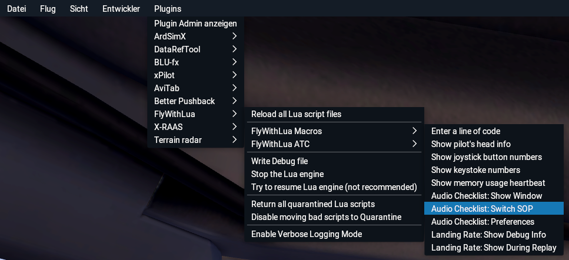

# Usage
You can either start the extension by using the X-Plane menu or by assigning a keyboard shortcut.

## Using the X-Plane menu
Move the mouse to the top of the screen and select the menu entry `Plugins > FlyWithLua > FlyWithLua Macros > Audio Checklist: Show Window`

## Assigning a keyboard shortcut
Open the control settings and enter `AudioChecklist` in the command search bar. Assign a key to the command to show and hide the checklists. You can also assign a button of your joystick using the `Joystick` tab.

## Selecting a standard operating procedure
When you first open the AudioChecklist window you will need to select a standard operating procedure (SOP) which you want to use for your flight:

The AudioChecklist core files do not contain any SOP. You need to install the SOPs you want separately.

The first dropdown menu lists the planes that you have SOPs for. The current loaded plane is automatically selected. The second dropdown menu lists all available SOPs for the selected plane.

If there are no SOPs installed for the current plane, then the list of SOPs is empty.

A SOP can come with different voices, which can be selected in the next two dropdown menus. The pilot flying (PF) will read the responses of a checklist and the pilot monitoring (PM) will read the challenges.

Click the button `Start` to confirm your choice. You can switch to a different SOP any time by selecting the menu entry `Plugins > FlyWithLua > FlyWithLua Macros > Audio Checklist: Switch SOP`:

Switching the SOP resets the state of the current checklists (i.e. they are no longer completed if the same SOP is selected again).

## Executing a checklist

Once a SOP has been selected, all available checklists are listed: 

Click on a checklist to select it. The content of the window now shows the checklist items.

The checklist starts automatically. Items which are checked successfully are marked green. If an item does not meet its requirements it is marked red. A failed item can be resolved by either fulfilling its requirements or by clicking the button `Skip`.

Some items can only be finished manually. In this case, the button `Skip` is renamed to `Done` and becomes green.

The command `Skip`/`Done` can also be assigned as a keyboard shortcut or joystick button. It is also possible to automatically finish the manual items by activating this option in the menu:

A white dot is displayed if the option is active.

The checklist can be paused by pressing the button `Pause`. The button is then renamed to `Resume`, which resumes the execution of the checklist. If the checklist is paused, the button `Skip` (or `Done`) is disabled and cannot be clicked. Pausing and resuming can also be assigned as a keyboard shortcut or joystick button.

If all checklist items have been finished, the content of the window switches back to the checklist overview. The button `Back` cancels the current checklist and also returns to the checklist overview. If a checklist is paused when being cancelled, the pause is also cancelled.

Each checklist can be repeated as often as needed.

## Limitations
* Hitting the assigned key or joystick button to show the checklist window is not always recognized if it is done multiple times in a short time period (e.g. closing the window and then immediately opening it again may won’t work).
* The minimum resolution of time is only one second. This can lead to sounds being played a second time if a checklist is resumed after it was paused right when the sound would finish playing. This may also cause sounds overlapping each other in this case.
